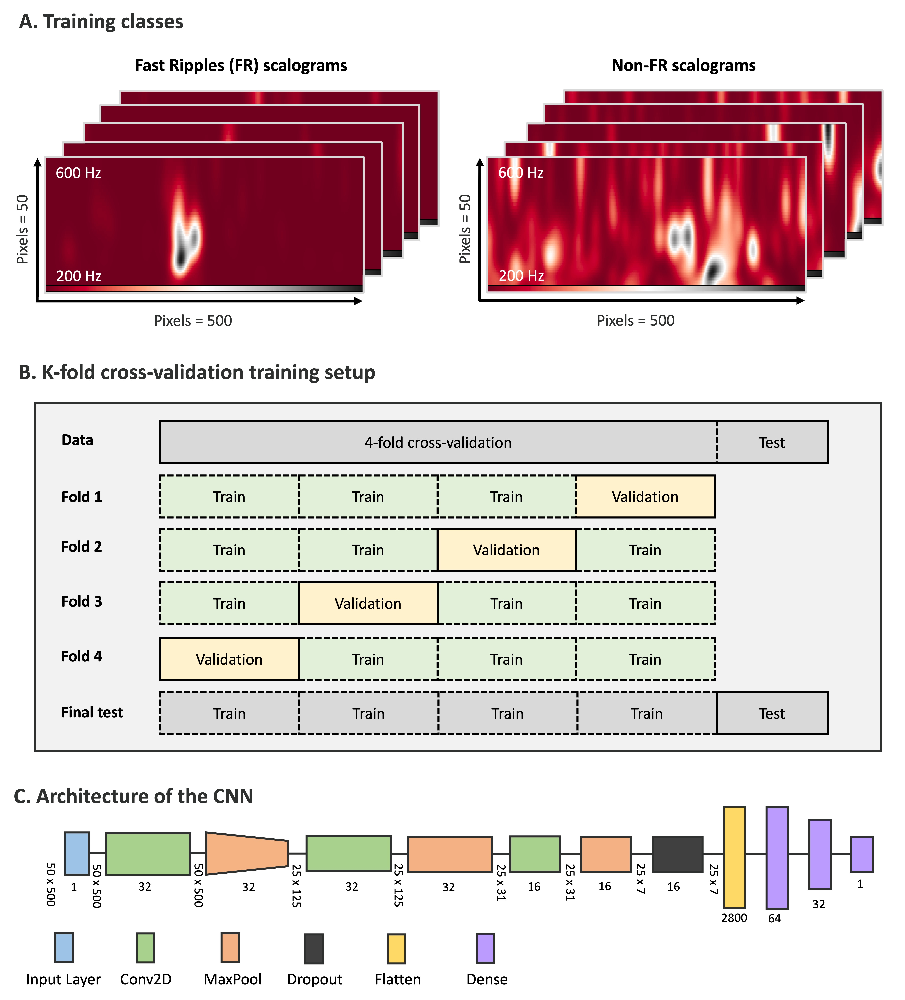
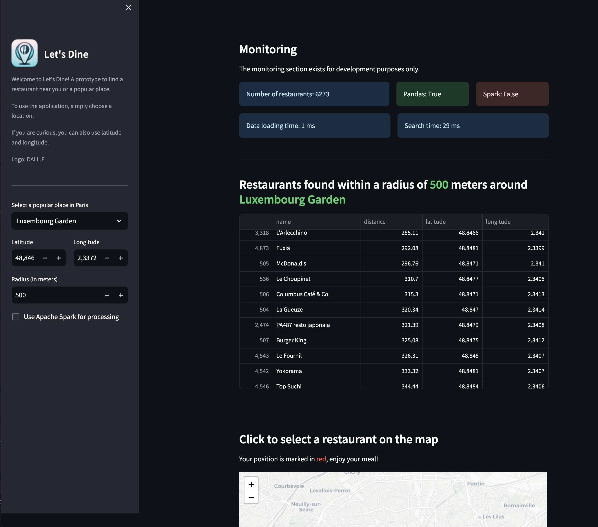
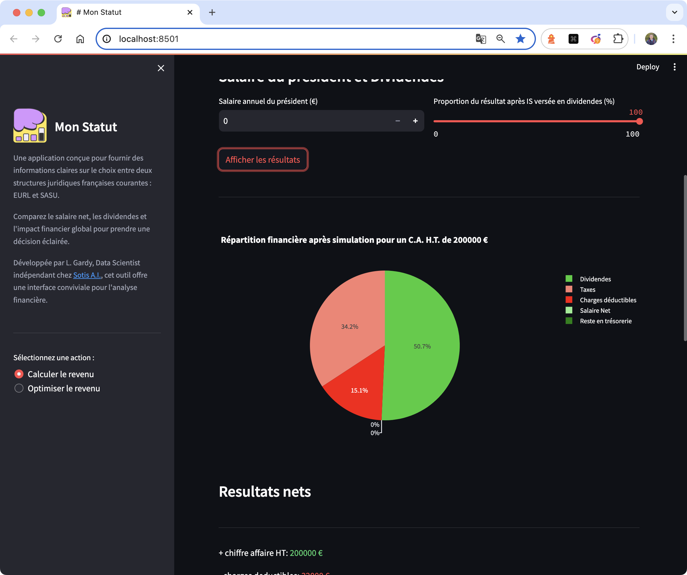
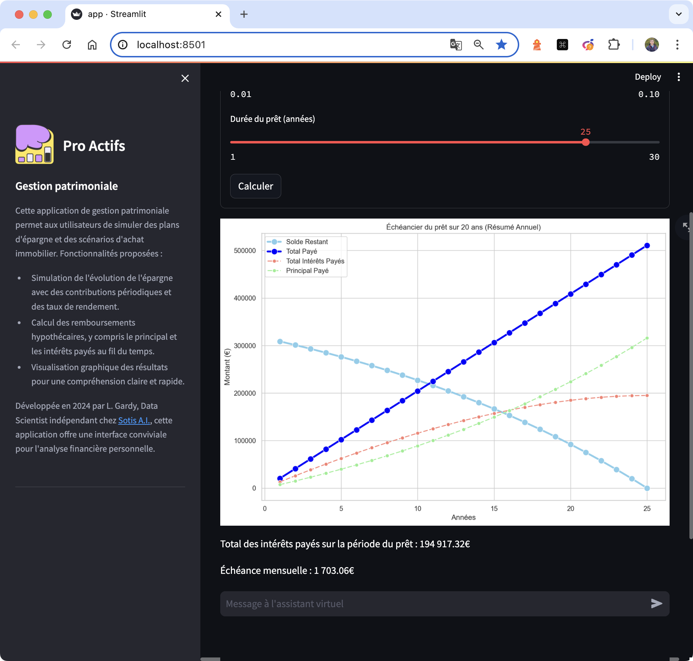

# Ludovic G. | Data Science for Strategic Innovation

Freelance Data Scientist dedicated to converting data into strategic business insights. My professional journey is fueled by a commitment to advanced scientific knowledge and technical proficiency, ensuring precise and efficient data handling at all levels.

Initially serving public health research, I spent several years developing software that combines AI and interactive data engineering and visualization (Ladybird | Halyzia©), now patented ([Brevet: FR3128111](https://data.inpi.fr/brevets/FR3128111)) and utilized by a French deep-tech startup (@Avrio MedTech). 

Over the years, I have learned to blend versatility with deep expertise to deliver impactful solutions to unsolved problems and optimize existing ones for greater efficiency. With extensive experience on numerous projects both before and after founding my company (@Sotis A.I.), I now operate as a freelance data scientist, providing expertise to businesses in need. 

Researcher, engineer but above all man of action and perpetual learner, I uncover value in data, no matter the complexity. From analyzing basic trends to optimizing data infrastructure and developing cutting-edge technological solutions, I am driven by the potential for significant impact and value creation.

A brief summary of some publicly shareable projects I have developed is presented in the sections below.

## Projects

### 🤖 Software, Algorithm & AI

#### Ladybird CNN
This project showcases the algorithm used in the Ladybird software to detect pathological anomalies in epilepsy, with a series of real-world examples. The CNN was trained to recognize these signals on scalograms obtained from intracerebral EEG of epileptic patients. The code in this repository is subject to a patent and thus, no longer fully accessible. Please contact me, or the startup @Avrio MedTech, for more information. **[Github repository](https://github.com/LudovicGardy/ladybird_CNN)**. 

#### Ladybird CNN Classes Weights
This project presents a separate study from the Ladybird software, focusing on the results of varying class weights (FR vs non-FR) during CNN training. Note: FR = Fast Ripple, a pathological brain oscillation in epilepsy. **[Github repository](https://github.com/LudovicGardy/ladybird_CNN_weights)**. 

#### Ladybird BIDS Converter
Data Engineering tool that converts EEG data into a [BIDS-like](https://bids.neuroimaging.io/) structure to standardize the format and nomenclature of clinical EEG data from Neuralynx and Micromed systems​. More information about BIDS structure here. **[Github repository](https://github.com/LudovicGardy/ladybird_converter_BIDS)**. 

#### Ladybird Performances Metrics
This work assesses the performance of the Ladybird method (CNN model & homemade algorithm), focusing on metrics like Sensitivity, Precision, and F-measure. Comparisons are made across anomaly levels (0, 5, 10, 15 dB) against other detectors on gold standard data. **[Github repository](https://github.com/LudovicGardy/ladybird_performance_steps)**. 

#### Convolutional Kernel Density Estimation
A method designed for robust data visualization and analysis, using an innovative technique specifically developed for anomaly detection in time series. Baptised "Convolutional Kernel Density Estimation" (CKDE), this approach enhances the detection and analysis of anomalies. **[Github repository](https://github.com/LudovicGardy/convolutional_kernel_density_estimation)**. 

#### Colormaps ReBaD
This project provides insightful data visualization tools, focusing on effective colormaps for detecting anomalies in high-frequency electrical signals, such as pathological anomalies in EEG data. Baptised "Referential Based Delineated" (ReBaD), this technique enhances the clarity and accuracy of anomaly detection. **[Github repository](https://github.com/LudovicGardy/colormaps_ReBaD)**. 

### 📱 Python App

#### Ladybird 3D Medical Visualizer - Standalone Version
An application to visualize 3D medical images, including MRI and PET scans, with dynamic enhancement features to improve visual analysis​. **[Github repository](https://github.com/LudovicGardy/ladybird_MRI)**. 

#### Sotis Immobilier
An application designed for French real estate management, providing tools for property listing, analysis, and market insights​. **[Github repository](https://github.com/LudovicGardy/app_sotisimmo)**. 

#### Let's Dine
A dining recommendation app that suggests meals and restaurants based on the user's geographical location (longitude and latitude). **[Github repository](https://github.com/LudovicGardy/app_lets_have_dinner)**. 

#### Business Status
If you are a French entrepreneur, you have likely wondered about the best legal status for your company or the one that maximizes your income. This app offers a guide to different legal structures, comparing benefits and tax implications, and provides personalized recommendations. **[Github repository](https://github.com/LudovicGardy/app_business_status)**. 

#### Mon Epargne
A financial management application that helps users track and optimize their savings and investments​. **[Github repository](https://github.com/LudovicGardy/app_asset_management)**. 

#### Team Picker
An app designed to randomly select a team member from a group, with features to choose the team, add or remove members. **[Github repository](https://github.com/LudovicGardy/app_team_picker)**. 

### 📊 Inferential Statistics

#### Epicea Epilepsy
This project compares the clinical, MRI, and EEG features of new-onset status epilepticus and non-inaugural status epilepticus to understand their distinctions and outcomes over one year. **[Github repository](https://github.com/LudovicGardy/epicea_epilepsy)**. 

#### Alzhimer Meta Analysis
This program allows users to reproduce the meta-analysis results from [L. Gardy et al., 2021] and [S. Joubert et al., 2021], or to perform new meta-analyses on other data using the same process and code. **[Github repository](https://github.com/LudovicGardy/meta_analysis_alzheimer)**. 

### 🌐 Web App

#### Sotis Analytics Frontend
This repository contains the code for the frontend of the Sotis Analytics website, providing the user interface and interaction elements. **[Github repository](https://github.com/LudovicGardy/webapp_sotisanalytics_front)**. 

#### Sotis Analytics Backend
This repository contains the code for the backend of the Sotis Analytics website, handling server-side logic, database interactions, and API endpoints. **[Github repository](https://github.com/LudovicGardy/webapp_sotisanalytics_back)**. 

## Contact

Pour plus d'informations, visitez mon [site web](https://www.sotisanalytics.com) ou mon [LinkedIn](https://www.linkedin.com/in/ludovic-gardy).
