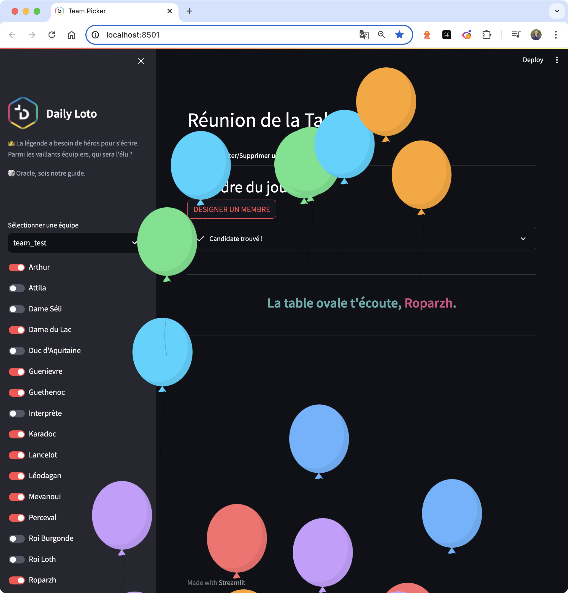

# Ludovic G. | Data Science for Strategic Innovation

Freelance Data Scientist dedicated to converting data into strategic business insights. My professional journey is fueled by a commitment to advanced scientific knowledge and technical proficiency, ensuring precise and efficient data handling at all levels.

Initially serving public health research, I spent several years developing software that combines AI with data engineering and interactive visualization (Ladybird | Halyzia©), now patented ([Brevet: FR3128111](https://data.inpi.fr/brevets/FR3128111)) and utilized by a French deep-tech startup (@Avrio MedTech). 

Over the years, I have learned to blend versatility with deep expertise to deliver impactful solutions to unsolved problems and optimize existing ones for greater efficiency. With extensive experience on numerous projects both before and after founding my company (@Sotis A.I.), I now operate as a freelance data scientist, providing expertise to businesses in need. 

Researcher, engineer but above all man of action and perpetual learner, I uncover value in data, no matter the complexity. From analyzing basic trends to optimizing data infrastructure and developing cutting-edge technological solutions, I am driven by the potential for significant impact and value creation.

A brief summary of some publicly shareable projects I have developed is presented in the sections below.

## Projects

### 🤖 Software, Algorithm & AI

<table width="100%">
  <thead>
    <tr>
      <th width="25%">Project</th>
      <th width="75%">Description</th>
    </tr>
  </thead>
  <tbody>
    <tr>
      <td></td>
      <td><strong><a href="https://github.com/LudovicGardy/ladybird_CNN">Ladybird CNN</a></strong> This project showcases the algorithm used in the Ladybird software to detect pathological anomalies in epilepsy, with a series of real-world examples. The CNN was trained to recognize these signals on scalograms obtained from intracerebral EEG of epileptic patients. The code in this repository is subject to a patent and thus, no longer fully accessible. Please contact me, or the startup @Avrio MedTech, for more information.</td>
    </tr>
      <tr>
      <td></td>
      <td><strong><a href="https://github.com/LudovicGardy/ladybird_performance_steps">Ladybird Performances Metrics</a></strong> This work assesses the performance of the Ladybird method (CNN model & homemade algorithm), focusing on metrics like Sensitivity, Precision, and F-measure. Comparisons are made across anomaly levels (0, 5, 10, 15 dB) against other detectors on gold standard data.</td>
    </tr>
      <tr>
      <td></td>
      <td><strong><a href="https://github.com/LudovicGardy/ladybird_CNN_weights">Ladybird CNN Classes Weights</a></strong> This project presents a separate study from the Ladybird software, focusing on the results of varying class weights (FR vs non-FR) during CNN training. Note: FR = Fast Ripple, a pathological brain oscillation in epilepsy.</td>
    </tr>
    <tr>
      <td></td>
      <td><strong><a href="https://github.com/LudovicGardy/ladybird_converter_BIDS">Ladybird BIDS Converter</a></strong> Data Engineering tool that converts EEG data into a <a href="https://bids.neuroimaging.io/">BIDS-like</a> structure to standardize the format and nomenclature of clinical EEG data from Neuralynx and Micromed systems​. More information about BIDS structure here.</td>
    </tr>
    <tr>
      <td></td>
      <td><strong><a href="https://github.com/LudovicGardy/convolutional_kernel_density_estimation">Convolutional Kernel Density Estimation</a></strong> A method designed for robust data visualization and analysis, using an innovative technique specifically developed for anomaly detection in time series. Baptised "Convolutional Kernel Density Estimation" (CKDE), this approach enhances the detection and analysis of anomalies.</td>
    </tr>
    <tr>
      <td></td>
      <td><strong><a href="https://github.com/LudovicGardy/colormaps_ReBaD">Colormaps ReBaD</a></strong> This project provides insightful data visualization tools, focusing on effective colormaps for detecting anomalies in high-frequency electrical signals, such as pathological anomalies in EEG data. Baptised "Referential Based Delineated" (ReBaD), this technique enhances the clarity and accuracy of anomaly detection.</td>
    </tr>
  </tbody>
</table>

### 📱 Python App

<table width="100%">
  <thead>
    <tr>
      <th width="25%">Project</th>
      <th width="75%">Description</th>
    </tr>
  </thead>
  <tbody>
    <tr>
      <td></td>
      <td><strong><a href="https://github.com/LudovicGardy/ladybird_MRI">Ladybird 3D Medical Visualizer - Standalone Version</a></strong> An application to visualize 3D medical images, including MRI and PET scans, with dynamic enhancement features to improve visual analysis​.   🌐 Use the web app: <a href="https://med-viewer-3d-35a20a74b896.herokuapp.com/">med-viewer.app</a></td>
    </tr>
    <tr>
      <td></td>
      <td><strong><a href="https://github.com/LudovicGardy/app_sotisimmo">Sotis Immobilier</a></strong> An application designed for French real estate management, providing tools for property listing, analysis, and market insights​.  
      🌐 Use the web app: <a href="https://immo.sotisanalytics.com">sotisimmo.app</a></td>
    </tr>
    <tr>
      <td></td>
      <td><strong><a href="https://github.com/LudovicGardy/app_lets_have_dinner">Let's Dine</a></strong> A dining recommendation app that suggests meals and restaurants based on the user's geographical location (longitude and latitude).</td>
    </tr>
    <tr>
      <td></td>
      <td><strong><a href="https://github.com/LudovicGardy/app_business_status">Business Status</a></strong> If you are a French entrepreneur, you have likely wondered about the best legal status for your company or the one that maximizes your income. This app offers a guide to different legal structures, comparing benefits and tax implications, and provides personalized recommendations.    🌐 Use the web app: <a href="https://business-status-583ac98f38cb.herokuapp.com/">business-status.app</a></td>
    </tr>
    <tr>
      <td></td>
      <td><strong><a href="https://github.com/LudovicGardy/app_asset_management">Asset Management</a></strong> A financial management application that helps users track and optimize their savings and investments​. </td>
    </tr>
    <tr>
      <td></td>
      <td><strong><a href="https://github.com/LudovicGardy/app_team_picker">Team Picker</a></strong> An app designed to randomly select a team member from a group, with features to choose the team, add or remove members.    🌐 Use the web app: <a href="https://teampicker-a7b18094f808.herokuapp.com">team-picker.app</a></td>
    </tr>
  </tbody>
</table>

### 📊 Inferential Statistics

<table width="100%">
  <thead>
    <tr>
      <th width="25%">Project</th>
      <th width="75%">Description</th>
    </tr>
  </thead>
  <tbody>
    <tr>
      <td></td>
      <td><strong><a href="https://github.com/LudovicGardy/epicea_epilepsy">Epicea Epilepsy</a></strong> This project compares the clinical, MRI, and EEG features of new-onset status epilepticus and non-inaugural status epilepticus to understand their distinctions and outcomes over one year.</td>
    </tr>
    <tr>
      <td></td>
      <td><strong><a href="https://github.com/LudovicGardy/meta_analysis_alzheimer">Alzhimer Meta Analysis</a></strong> This program allows users to reproduce the meta-analysis results from [L. Gardy et al., 2021] and [S. Joubert et al., 2021], or to perform new meta-analyses on other data using the same process and code.</td>
    </tr>
  </tbody>
</table>

### 🌐 Web App

<table width="100%">
  <thead>
    <tr>
      <th width="25%">Project</th>
      <th width="75%">Description</th>
    </tr>
  </thead>
  <tbody>
    <tr>
      <td></td>
      <td><strong><a href="https://github.com/LudovicGardy/webapp_sotisanalytics_front">Sotis Analytics Frontend</a></strong> This repository contains the code for the frontend of the Sotis Analytics website, providing the user interface and interaction elements.</td>
    </tr>
    <tr>
      <td></td>
      <td><strong><a href="https://github.com/LudovicGardy/webapp_sotisanalytics_back">Sotis Analytics Backend</a></strong> This repository contains the code for the backend of the Sotis Analytics website, handling server-side logic, database interactions, and API endpoints.</td>
    </tr>
  </tbody>
</table>

## Github Contributions
<table>
  <tr>
    <td>
      
    </td>
    <td>
      
    </td>
  </tr>
  <tr>
    <td colspan=2 align="center">
      
    </td>
  </tr>
</table>

## Github Trophies

<!--  -->

## Author
- LinkedIn: [Ludovic Gardy](https://www.linkedin.com/in/ludovic-gardy/)
- Website: [Sotis A.I.](https://www.sotisanalytics.com)
- Doctoral thesis: [PDF](http://thesesups.ups-tlse.fr/5164/1/2021TOU30190.pdf)
<h6 align="left"> <i>This counter was added on 14-08-2024</i></h6>

